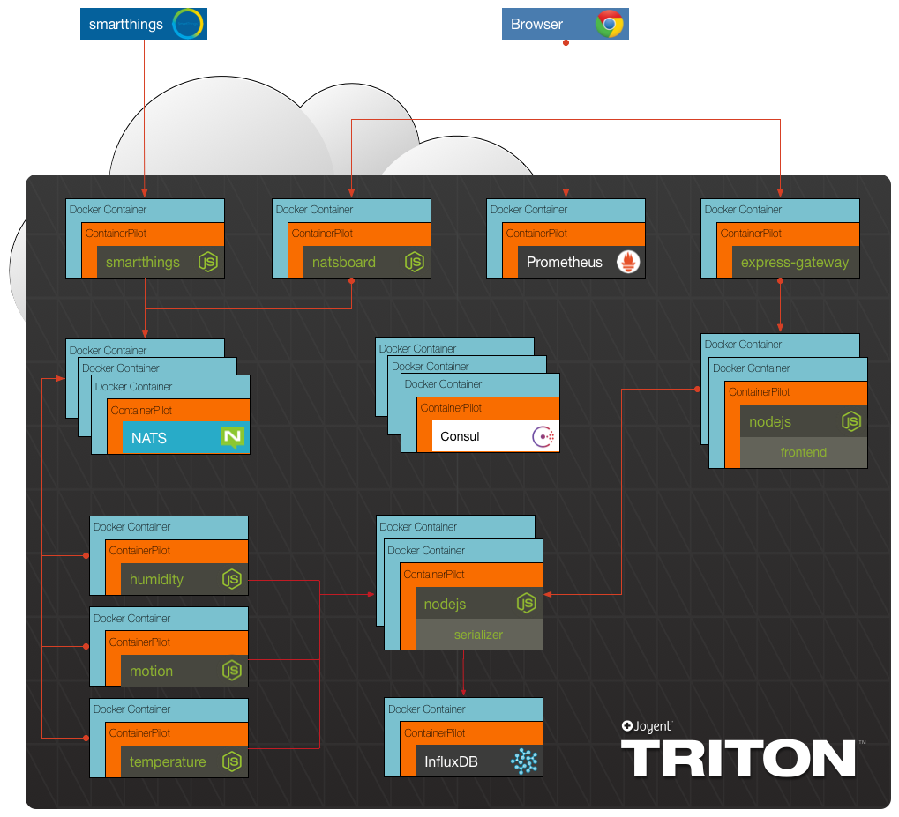

## Summary

Example microservices implementation using Node.js and Docker. Below is an architectural diagram depicting the composition of services that make up the project. When everything is working a frontend web application is accessible that will display a set of graphs using sensor data. The sensor data is either generated by the smartthings microservice or is sent to the microservice from a SmartThings hub running a Sensor SmartApp.

## Prerequisites

1. npm 4.x or npm 5.3.1 or newer. 
2. A recent docker version

## Challenges

The workshop is divided into challenges. In each challenge folder there is a readme that explains the requirements for the challenge. In the challenge folder is also a solution file that explains how to solve the challenge. Below is a list of the different challenges.

1. [Startup the frontend with node](./challenge1)
2. [Startup the frontend with docker](./challenge2)
3. [Startup the gateway and 2 frontend instances with docker-compose](./challenge3)
4. [Scale the frontend behind the gateway using docker with ContainerPilot](./challenge4)
5. [Add smartthings, NATS, a worker (temperature), serializer, and influxdb](./challenge5)
6. [Add the humidity and motion workers](./challenge6)
7. [Add prometheus and connect telemetry](./challenge7)

## Credits

This project is inspired by various microservices workshops and trainings. In no particular order, they are:
* https://github.com/lloydbenson/microservices-workshop - Lloyd Benson
* https://github.com/nearform/micro-services-tutorial-iot - nearForm
