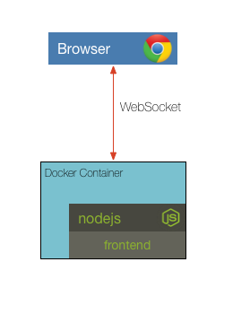

## Challenge 2

Your challenge is to update the Dockerfile so that it runs `npm install` and has the appropriate `CMD` to start the frontend. Test your solution by building the docker image, creating a docker container, then running the container.

__hint__ the frontend expects an environment variable named PORT

__hint__ dockerfile documentation can be found at https://docs.docker.com/engine/reference/builder/

### [Solution](./SOLUTION.md)

## Next Up: [Challenge 3](../challenge3/README.md)
