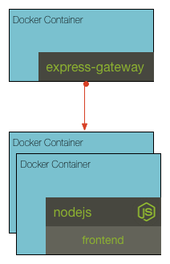

## Challenge 3

We want to put a gateway in front of the frontend service so that we can scale the frontend to more than one instance. To do this we will use docker-compose with a couple of frontend containers (frontend1 and frontend2). Your challenge is to update the _gateway/gateway.config.yml_ with the `urls` pointing to frontend1 and frontend2, then add `links` in the docker-compose for the gateway to reference the frontend1 and frontend2 instances. Verify the results by running `docker-compose up -d` and navigating to the gateway port (localhost:8080).

__hint__ information on express-gateway can be found at http://express-gateway.io

__hint__ docker-compose documentation can be found at https://docs.docker.com/compose/compose-file/compose-file-v2/

### [Solution](./SOLUTION.md)

## Next Up: [Challenge 4](../challenge4/README.md)
