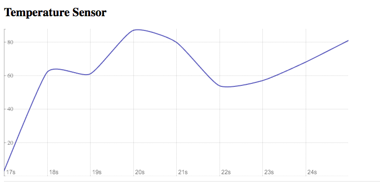

## Solution to Challenge 3

Add the following lines to the gateway/gateway.config.yml file
```
urls:
  - 'http://frontend1:8080'
  - 'http://frontend2:8080'
```

Update the docker-compose gateway `links` section with the following entries
```sh
links:
  - frontend1
  - frontend2
```

Start the containers with
```sh
docker-compose up -d
```

Point your browser to [http://localhost:8080](). You should see a chart, like the one shown here:



You can stop and remove the containers by running the following:

```sh
docker-compose down
```
