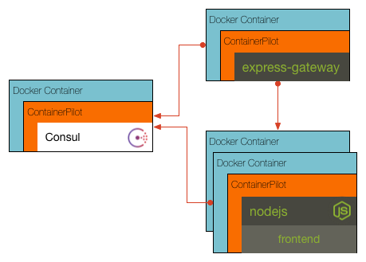

## Challenge 4

Using docker links isn't a good method for scaling. Instead we will add consul and use ContainerPilot to register our services with consul for us. Once this is done we can use the `docker-compose scale` command to add more instances of the frontend and have them balanced through the gateway. Your challenge is to update the gateway/etc/containerpilot.json5 file to run the `bin/generate-config` file before starting the gateway and on any change to the frontend that is detected in consul.

__hint__ ContainerPilot documentation can be found at https://www.joyent.com/containerpilot/docs
__hint__ You need to add a job to execute `generate-config`

### [Solution](./SOLUTION.md)

## Next Up: [Challenge 5](../challenge5/README.md)
