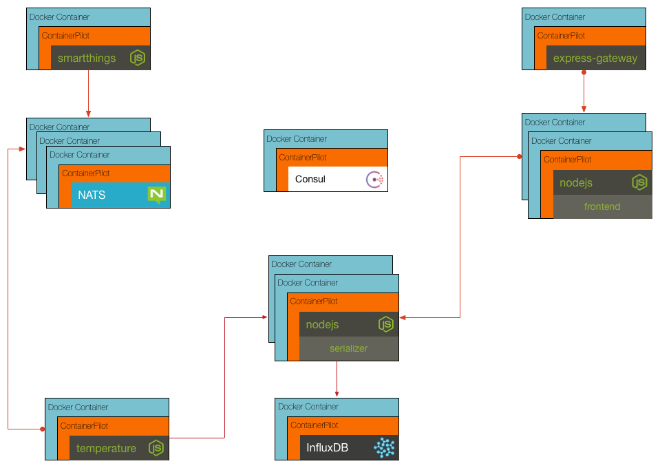

## Challenge 5

We now need to wire up more services and discover them through consul. This will allow us to add in the serializer microservice, temperature worker, influx database, NATS message server, and SmartThings microservice.

Your challenge is to update the `sensor/lib/index.js` file so that the `writeData` function is able to retrieve the address from Consul using the Piloted module. After this is done, you will need to update the `containerpilot.json5` configuration file for the sensor to have a watch for the 'serializer' and an onchange job, similar to the existing one for NATS.

__hint__ ContainerPilot documentation can be found at https://www.joyent.com/containerpilot/docs
__hint__ Piloted documentation can be found at https://www.npmjs.com/package/piloted

### [Solution](./SOLUTION.md)

## Next Up: [Challenge 6](../challenge6/README.md)
