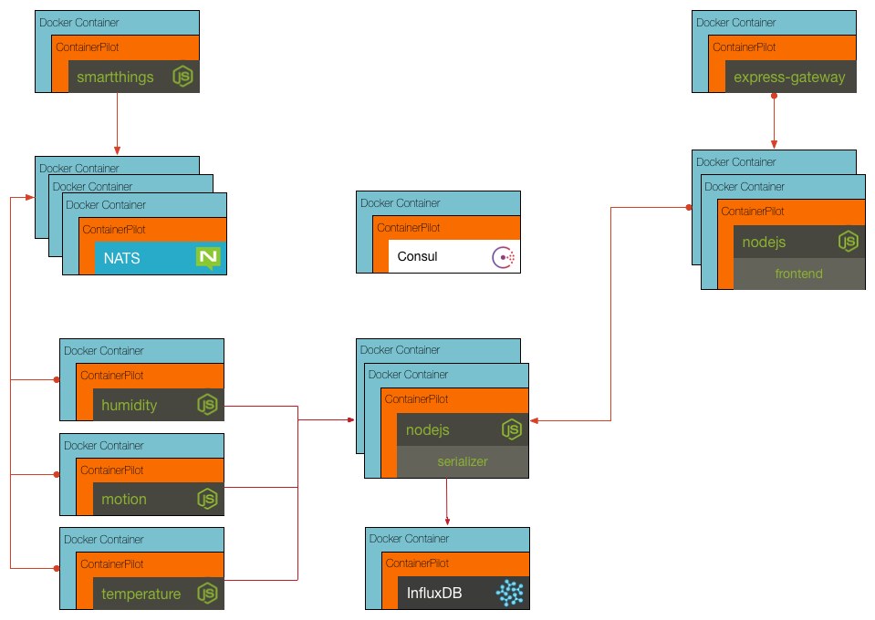

## Challenge 6

We need to add the other sensor workers to be able to pull the humidity and motion data from NATS. Your challenge is to update the docker-compose.yml file with entries for humidity and motion. Verify your results my starting everything and checking that the charts are updating for humidity and motion.

__hint__ docker-compose documentation can be found at https://docs.docker.com/compose/compose-file/compose-file-v2/

### [Solution](./SOLUTION.md)

## Next Up: [Challenge 7](../challenge7/README.md)
