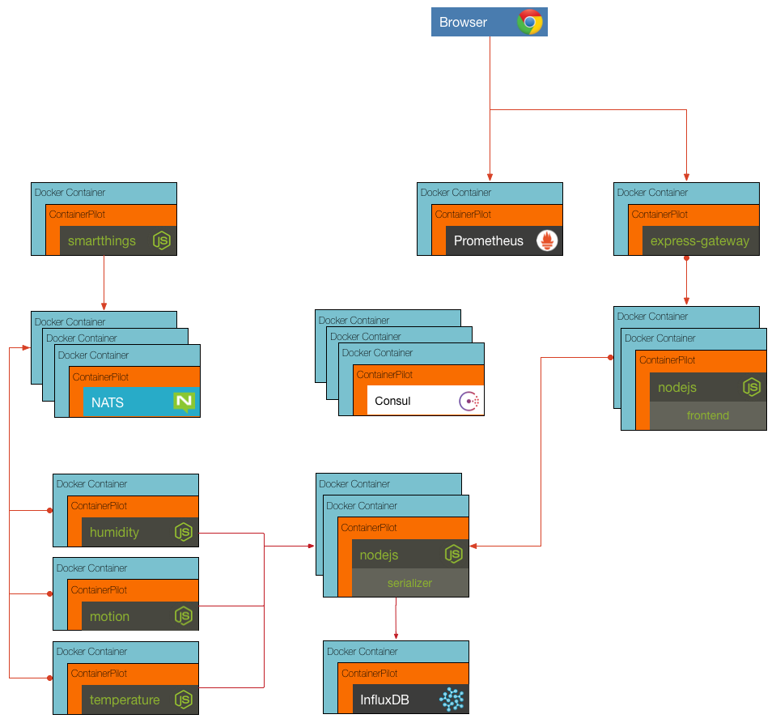

## Challenge 7

We want to add telemetry support to the serializer to report on event loop delay. ContainerPilot is already configured to expose the telemetry port for Prometheus inside of the serializer. Your challenge is to add another entry for `event_delay` to the telemetry section of the serializer containerpilot.json5 file. Once this is done verify your results by visiting the Prometheus dashboard at `localhost:9090` and running the event delay metric.

__hint__ toppys documentation can be found at https://www.npmjs.com/package/toppsy

__hint__ ContainerPilot documentation can be found at https://www.joyent.com/containerpilot/docs

### [Solution](./SOLUTION.md)

## Next Up: [Final!](../final/README.md)
